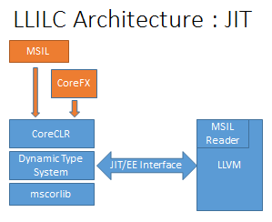
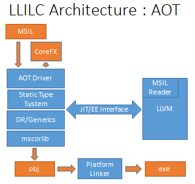

# LLILC Architecture Overview

## Introduction

LLILC is a code generator based on LLVM for MSIL (C#).  The intent of the architecture is to allow 
compilation of MSIL using industrial strength components from a C++ compiler.  LLVM gives us the 
infrastructure to do this but additions are required to bring managed code semantics to LLVM. The 
LLILC architecture is split broadly into three logical components.  First, high level MSIL transforms, 
that expand out high level semantics into more MSIL, second, high level type optimizations that removes 
unneeded types from the program, and third translation to LLVM BitCode and code generation.   

Since we're in the early days of the project we've taken the third item first.  Today we're building 
a JIT to allow us to validate the MSIL translation to BitCode as well as build muscle on LLVM.  This 
will be followed by work on the required high level transforms, like method delegates, and generics, 
to get the basics working for AOT, and lastly the type based optimizations to improve code size and 
code quality.

The rest of the document outlines architecture but leaves some elements minimally defined since these 
areas still need to be fully fleshed out.

## Architectural Components

The following are the main components of the system.  In the case of CoreCLR and LLVM, these components 
are provided by other projects/repositories and provide their own documentation.  Others, like the MSIL 
reader, are provided by LLILC.

#### CoreCLR

The CoreCLR is the open source dynamic execution environment for MSIL (C#). It provides a dynamic type system, 
a code manager that organizes compilation, and an execution engine (EE).  Additionally the runtime provides the 
helpers, type tests, and memory barriers required by the code generator for compilation.  The LLILC JIT takes a 
dependency on a particular version of the common JIT interface provided by the CoreCLR and requires the specific 
version of the runtime that supports that interface.

There are a number of documents in the [CoreCLR](https://github.com/dotnet/coreclr) repo 
that are [indexed here](https://github.com/dotnet/coreclr/blob/master/Documentation/index.md) 
which can give a more complete overview of the CoreCLR.

#### Garbage Collector

The CLR relies on a precise, relocating garbage collector.  This garbage collector is used within CoreCLR 
for the JIT compilation model, and within the native runtime for the AOT model.  The types for objects allocated 
on the heap are used to identify fields with GC references, and the JIT is required to report stack slots and registers that 
contain GC references.  This information is used by the garbage collector for updating references when heap objects 
are relocated.  A discussion of the garbage collector as used by LLILC is 
[here](llilc-gc.md).

#### MSIL reader

The key component needed to start testing code generation out of LLVM and get basic methods working 
is an MSIL reader.  This component takes a request from [CoreCLR](https://github.com/dotnet/coreclr) to 
compile a method, reads in all the method MSIL, maps the required types into LLVM, and translates the MSIL 
opcodes into BitCode. The base Reader code is [here](../lib/Reader/reader.cpp) 
and the main entry point is ReaderBase::msilToIR().  From this starting point MSIL is converted into equivalent 
BitCode.  In organization the reader is made up of a base component that interfaces with the CLR/EE interface 
and [readerir](../lib/Reader/readerir.cpp) which is responsible 
for generating the actual BitCode.  This separation of concerns allows for easier refactoring and simplifies 
BitCode creation.

#### LLVM

[LLVM](http://llvm.org/) is a great code generator that supports lots of platforms and CPU targets.  It also has 
facilities to be used as both a JIT and AOT compiler.  This combination of features, lots of targets, and ability 
to compile across a spectrum of compile times, attracted us to LLVM.  For our JIT we use LLVM's ORC JIT
infrastructure.

There is a further discussion of how we're modeling the managed code semantics within LLVM in a following 
[section](#managed-semantics-in-llvm).

#### IL Transforms

IL Transforms precondition the incoming MSIL to account for items like delegates, generics, and inter-op thunks. 
The intent of the transform phases is to flatten and simplify the C# language semantics to allow a more straight 
forward mapping to BitCode.

This area is not defined at this point other than to say that we're evaluating what approaches to bring over from 
Windows.

#### Type Based Optimizations

A number of optimizations can be done on the incoming programs type graph.  The two key ones are tree shaking, and 
generics sharing. In tree shaking, unused types and fields are removed from the program to reduce code size and improve 
locality.  For generic sharing, where possible generic method instances are shared to reduce code size.

Like the IL transforms this area is not defined.  Further design work is needed for this within the AOT tool.

#### Exception Handling Model

The CLR EH model includes features beyond the C++ Exception Handling model.  C# allows try{} and catch(){} clauses like in 
C++ but also includes finally {} blocks as well.  Additionally there are compiler synthesized exceptions that will be thrown 
for accessing through a null reference, accessing outside the bounds of a data type, for overflowing arithmetic, and divide 
by zero. Different languages on the CLR can implement different subsets of the CLR EH model. A general C# introduction to CLR 
EH can be found [here](https://msdn.microsoft.com/en-us/library/ms173162.aspx). For more specific information refer to 
the ECMA spec [here](http://www.ecma-international.org/publications/standards/Ecma-335.htm). 
In LLILC we will explicitly expand the CLR required checks in to explicit flow, while for the additional clauses, use 
the funclet design that is emerging in LLVM to support MSVC-compatible EH.  A full description of our EH approach can be 
found in our documentation [here](llilc-jit-eh.md).

#### Ahead of Time (AOT) Compilation Driver

The Ahead of Time driver is responsible for marshalling resources for compilation.  The driver will load 
the assemblies being compiled via the Simple Type System (STS) and then for each method invoke the MSIL 
reader to translate to BitCode, with the results emitted into object files.   The resulting set of objects 
is then compiled together using the LLVM LTO facilities.

#### Simplified Type System

The Simplified Type System is a C++ implementation of a MSIL type loader.  This component presents the driver and 
code generator with an object and type model of the MSIL assembly.

#### Dependency Reducer (DR) and Generics

As mentioned above the DR and Generics support is still being fleshed out.  We don't quite have a stake in the 
ground here yet.

## Just in Time Code Generator

As laid out above the JIT runs with CoreCLR, where the runtime requests compilation from the code generator as it is needed 
during execution.  This dynamic execution relies on the dynamic type system contained in CoreCLR as well as several utilities 
provided by the runtime.  All of these facilities that the JIT relies on are exposed to it via the CoreCLR common JIT 
interface.  This is a simpler environment for the compiler to work in.  It just needs to service requests and all generic, 
inter-op, and interface dispatch complexity is resolved by the runtime and provided by query across the JIT interface. This 
code generator is being brought up first due to its relative simplicity in getting test cases working and providing a test bed 
to implement the managed semantics in LLVM.  All of the features required in the JIT will be reused by the AOT framework with 
additional components added. 

## Ahead of Time code generator

In our approach the AOT compiler utilizes the JIT code generator by implementing the same common JIT interface that the CoreCLR 
implements.  But ahead of time, the type system queries are backed by the simplified type system, and the AOT driver does the 
transitive closure of referenced types and invokes the compiler for all needed methods to translate to BitCode.  Finally all 
BitCode is compiled together and then linked by the platform linker to the static runtime libs. 

A more complete document specifying the ahead of time approach at a deeper level is forthcoming and will be linked here when 
it's available.

## Managed Semantics in LLVM

### Managed optimizations

#### Managed Checks
CLR semantics includes checks for certain kind of programing faults in an attempt to avoid certain common programmer errors. 
These extra checks are implicit in the code and produce catchable exceptions.  The following checks are implemented in MSIL. 

- Null pointer check.  If a null pointer is dereferenced a NullReferenceException is thrown by the program.
- Bounds check.  If there is an access outside of an object an IndexOutOfRangeException is thrown by the program.
- Arithmetic overflow check. If the checked keyword is used, or /checked command line option is used, an OverflowException is 
thrown for any arithmetic overflow in the program.    
- Division by zero.  A DivisionByZeroException is thrown for any division of an integral or decimal by zero.

Each of these checks, if naively inserted into the code, could cause a great deal of overhead.  For each case above 
there are optimizations that will either compute that the required invariant is either implied by a prior check or other code, 
or can synthesize a check that will precondition a number of accesses/operations.  This language specific optimizations will 
need to be added to LLVM either through extending current passes or the introduction of new passes.   

### Managed pointers

#### Supporting GC via Statepoints
Statepoints will be inserted early during bring up to enforce correctness but we plan to switch to a late insertion scheme 
to gain more benefit from the mid-level optimizer.

#### Interior vs base pointers
The GC used by the CLR differentiates between reported base pointers and interior pointers (see 
[Garbage Collection](llilc-gc.md#interior-pointers) doc for 
more details).  In simple terms an interior pointer results from an arithmetic operation on a base pointer if the resulting 
pointer is still contained within the object being referenced. (Exterior pointers are not supported.) While all pointers can 
be reported as interior this will increase the overhead of the GC since more checks are required to establish the object 
from an interior pointer.
